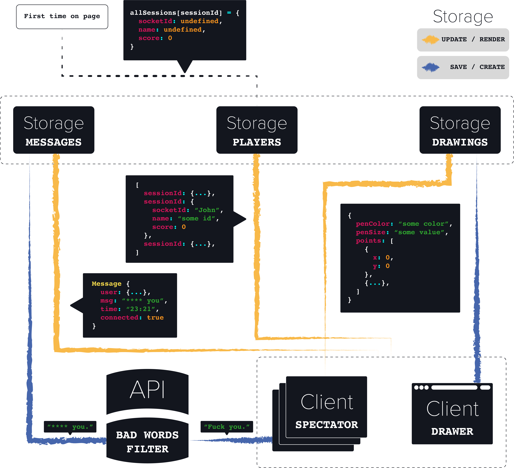

# drawing-game
### Jesse Dijkman

## Assignment
For this course we're going to make a real-time-application, with the use of websockets. The app is going to maintain live connections between the server and clients and enable communication between the clients. To make the use of websockets easier I'm going to use [socket.io](https://socket.io/).

---

## Table of Contents
- [Getting Started](#getting-started)
  - [Installation](#installation)
  - [Running](#running)
- [Concept](#concept)
  - [Version 1](#version-1)
  - [Version 2](#version-2)
  - [Version 3](#version-3)
- [Data Life Cycle](#data-life-cycle)
  - [Steps](#steps)
- [Process](#process)
  - [Week 1](#week-1)
  - [Week 2](#week-2)
  - [Week 3](#week-3)
  - [Resits](#resits)
- [Sources](#sources)
- [License](#license)

---

## Getting Started
### Installation
- `git@github.com:jesseDijkman1/drawing-game.git`
- `cd drawing-game`
- `npm install`

### Running
`npm start`

---

## Concept
A drawing-game where users get turns to draw a random noun. The spectators have to guess the word, when guessed the drawer and spectator get points. When no one guesses it, the drawer gets negative points. The points are saved on the server at the matching session id.

### Features
- **Pen Options**
  - Size
  - Color
- **Chat**
- **Scoreboard**

---

## Data Life Cycle


### Steps
- **The user visits the page for the first time**
  - With the use of express session a new object is created for the user.
  - He/she get's redirected to a page where he/she can make a user name.
  - This name is added to the object on the server
  
- **The user joins the room**
  - Their socket.id is added to their account object
  
- **Enough players in a room => Start game**
  - All messages are cleared
  - A drawer/artist is picked
  
- **New round**
  - Update player scors
  - All messages are cleared
  - All drawings are cleared
  

---

## Process
### Week 1
In the first week (first day) I created a simple drawing app with a chat. Which was waaay too easy, so I wanted to make another app. A platform shooter.

### Week 2
During this week I worked on the platform shooter, I created the movement and shooting mechanics. I just had a lot of trouble with coming up with an API to use.

### Week 3
In this week I switched back to my drawing app, because my search for an API really slowed me down. But in this week I didn't find an API either and eventually gave up.

### Resits
During my resits I started on a new drawing app. But I couldn't help and use this time learn more about javascript `classes`; like `extends` `get` `set` `super`. I also tried to keep my code as clean as possible. This all led to me wasting my time.

--- 

## Code
**Retrieving the session id**
```js
function cookieSession(socket) {
  return new Promise((resolve, reject) => {
    const rough = cookie.parse(socket.request.headers.cookie)["connect.sid"],
          rx = /(?<=s:).+?(?=\.)/;

     resolve(rx.exec(rough)[0])
  })
}
```
> Get the session id from the socket object

**Rendering the drawings**
```js
renderDrawing(drawing) {
      this.ctx.lineJoin = "round";
      this.ctx.strokeStyle = drawing.penColor;
      this.ctx.lineWidth = drawing.penSize;

      drawing.points.forEach((p, i, a) => {
        this.ctx.beginPath();

        if (i == 0) {
          this.ctx.moveTo(this.x, this.y)
        } else {
          this.ctx.moveTo(a[i - 1].x, a[i - 1].y)
        }

        this.ctx.lineTo(p.x, p.y)
        this.ctx.closePath()
        this.ctx.stroke()
      })
  }
```
> Create lines with the coordinates

---

## Sources
- [API](https://www.neutrinoapi.com/api/bad-word-filter/)
- [Nouns List](http://www.desiquintans.com/articles/noungenerator.php)
---

## License
MIT © [Jesse Dijkman](https://github.com/jesseDijkman1)
